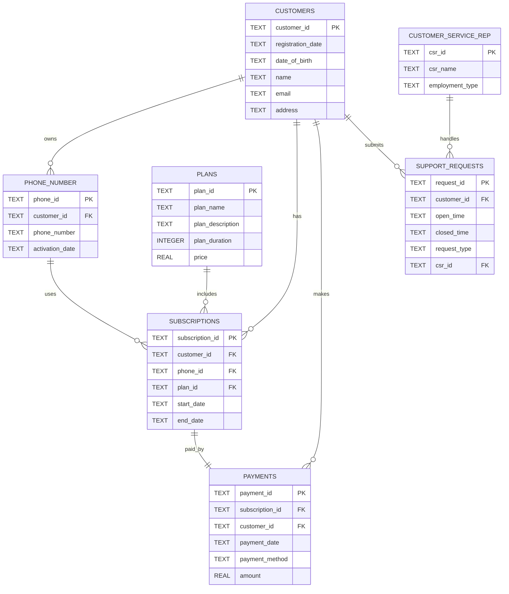

# Entity Relationship Diagram

This ERD describes the relational structure used for the VitaSignal telecom database project.

## Relationship Summary

- One customer can own multiple phone numbers.
- One customer can have multiple subscriptions.
- One phone number can have multiple subscription cycles.
- One plan can be used by many subscriptions.
- Each subscription has one payment record.
- One customer can make multiple payments.
- One customer can submit multiple support requests.
- One customer service representative can handle multiple support requests.
